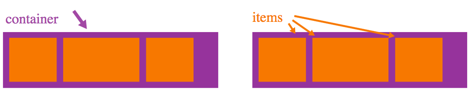

## Objective

The Flexbox Layout aims at providing a way 
- to lay out items in a container, 
- align and distribute space among items in a container (even when their size is unknown and/or dynamic - thus the word "flex").

A flex container:
 - eihter expands items to fill available free space, 
 - or shrinks them to prevent overflow.

Flexbox layout is most appropriate to the components of an application, and small-scale layouts, while the Grid layout is intended for larger scale layouts.

## Basic terms

## display: flex vs inline-flex
- **flex** Displays an element as a block-level flex container
- **inline-flex** Displays an element as an inline-level flex container

| flex          | inline-flex   |
| ------------- |-------------  |
| col 3 is      | right-aligned |