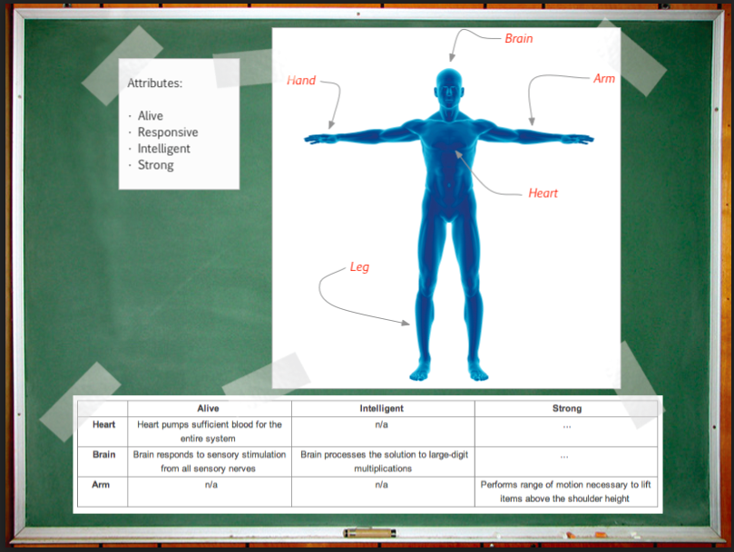

frequent delivery pretty much guarantees that the system is changing faster than it’s possible to keep test documentation up to date.

solution: the list of changes implemented as part of the milestone needs to be preserved
solution: we need an effective way to capture and organise information about what the system does now which can easily incorporate future changes.

capabilities are what your application actually does; they are just like features, except they are tied to a specific Attribute and Component pair

solution: The
attribute-component-capability (ACC) matrix is a technique for visualising and
organising test ideas and risk information,

It is a table in which 
 - columns have the names of quality attributes, 
 - rows: system components are represented by rows, 
 - cells: system capabilities provided by the components to satisfy quality attributes

so by tracking what changes have been made from commit to commit (they'll be linked to system components) it's possible to prioritize exploratory testing

example of ACC matrix
